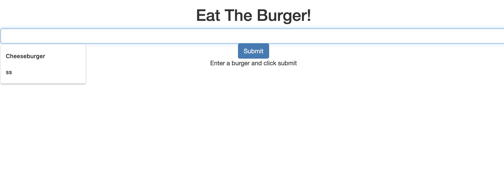

# burger
Launches a restaurant app that lets users input the names of burgers they'd like to eat

## Technologies
mySQL, Node, Express,

## Progress
The app works on my browser but not on Heroku. It has been deployed to Heroku.
The design still needs work.

## Heroku
https://floating-hamlet-93529.herokuapp.com/burgers

## Screenshot

